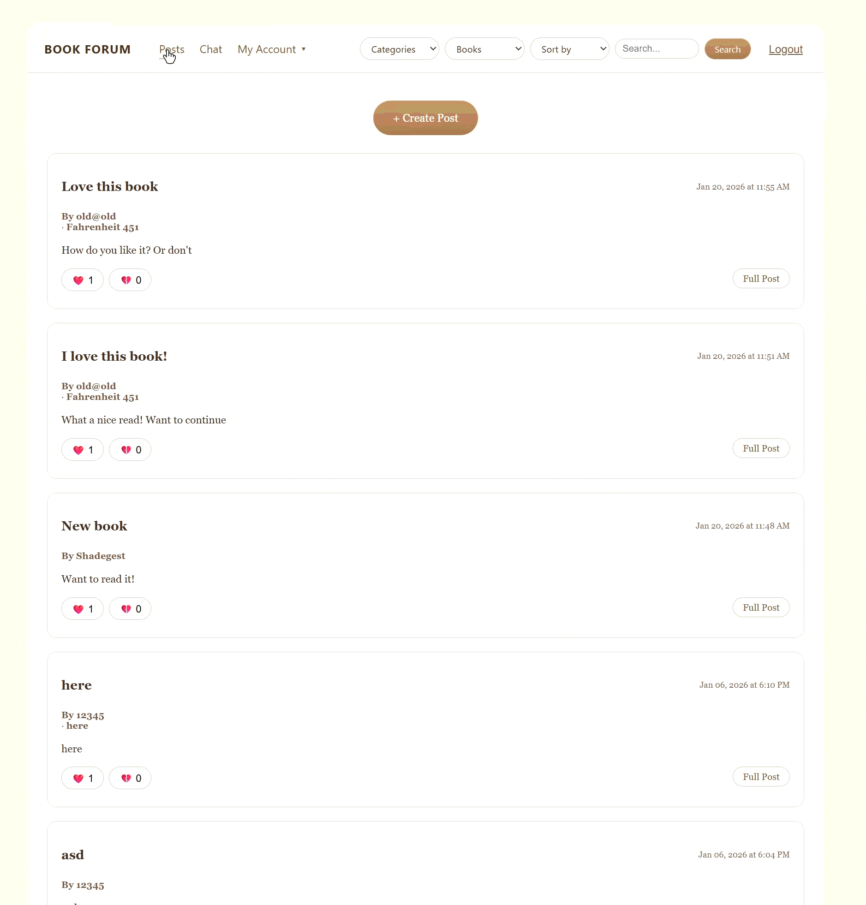
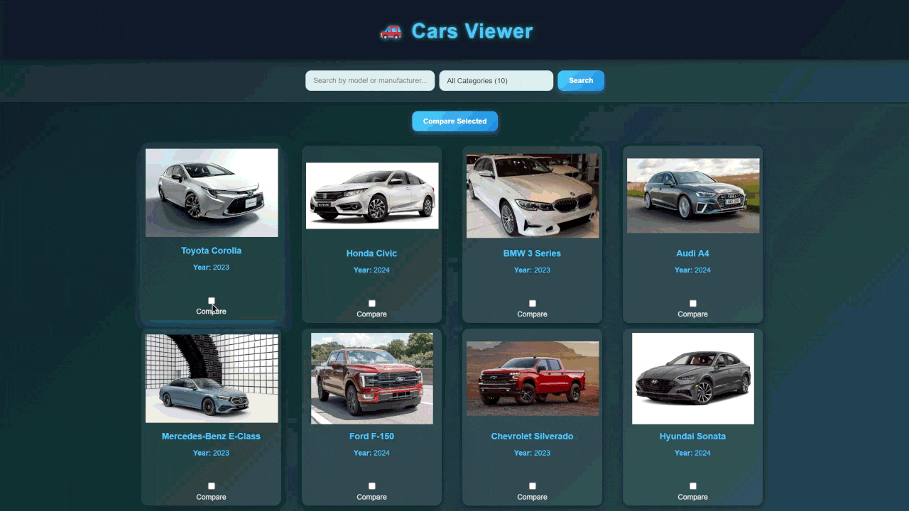
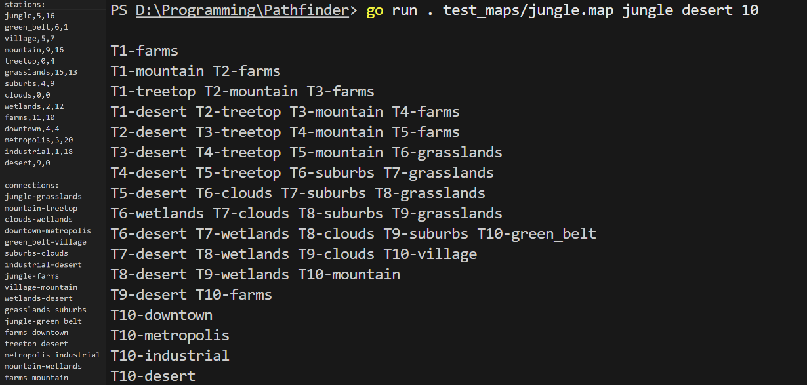
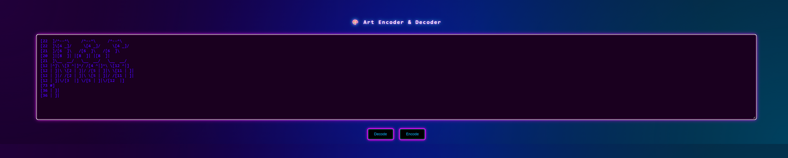
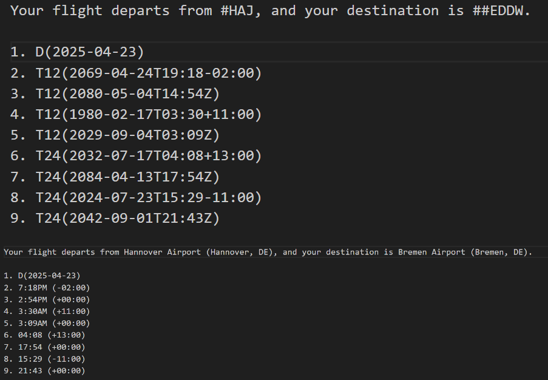

<div align="center">


</div>

---

# Mykyta Burachenko

Full-stack software developer focused on backend engineering, scalable system architecture, cloud infrastructure, cybersecurity, and performance optimization.

Currently building scalable applications using Go, TypeScript, PostgreSQL, Docker, GraphQL, React, JWT authentication, OAuth integrations, and microservice-oriented architectures.

---

## About Me

```javascript
const shadegest = {
  location: "Helsinki, Finland",
  school: "Kood/Sisu",
  
  focus: [
    "Full-stack Development",
    "Backend Engineering",
    "System Architecture",
    "Performance Optimization",
    "Cybersecurity"
  ],

  techStack: {
    languages: ["Go", "TypeScript", "Python", "SQL", "C++"],
    
    frontend: [
      "React",
      "HTML5",
      "CSS3",
      "Vite",
      "Three.js"
    ],

    backend: [
      "GraphQL",
      "REST APIs",
      "JWT",
      "OAuth2",
      "WebSockets",
      "Docker",
      "PostgreSQL",
      "MySQL"
    ],

    infrastructure: [
      "Docker Compose",
      "Linux",
      "Git",
      "Azure Fundamentals"
    ]
  },

  learning: [
    "Distributed Systems",
    "Scalable Architectures",
    "Cloud Infrastructure",
    "Cybersecurity"
  ]
};
```
---

## Featured Projects

### Full-Stack & Backend Projects

- [Find Friend](https://github.com/Shadegest/find_friend)  
  Full-stack recommendation platform built solo using React, GraphQL, REST APIs, Go, TypeScript, PostgreSQL, Python(Django), Docker, JWT, and OAuth.

- [Find Your Interest](https://github.com/Shadegest/find_your_interest)  
  Similar production-ready project developed in a team of three to better understand scalable architecture, backend/frontend separation, and collaborative workflows.

- [Race Track Control](https://github.com/Shadegest/Race_track_control)  
  Real-time race control dashboard using WebSockets for lap tracking, timing, start/finish events, and live race state synchronization.

- [flickering.ink](https://flickering.ink)  
  Production portfolio website with JavaScript-driven UI/UX, optimized LCP performance, lazy loading, and responsive frontend design.

---

## Go Projects

- [Book Forum](gif/book-forum/book-forum.gif) [](gif/book-forum/book-forum.gif)
- [Cars Viewer](gif/cars/cars.gif) [](gif/cars/cars.gif)
- [Route Finder for Trains (Graphs)](screenshots/route/route.png) 
- [Text Encoder / Decoder with HTML](screenshots/art-decoder/art-decoder.png) 
- [Airport Code and Date Formatter](screenshots/airport/airport.png) 

---

## Tech Stack

<p align="center">

<strong>Languages</strong><br/>

<a href="https://go.dev">
  
</a>

<a href="https://www.typescriptlang.org/">
  
</a>

<a href="https://isocpp.org">
  
</a>

<a href="https://www.python.org">
  
</a>

<br/><br/>

<strong>Frontend</strong><br/>

<a href="https://react.dev">
  
</a>

<a href="https://vitejs.dev">
  
</a>

<a href="https://threejs.org">
  
</a>

<br/><br/>

<strong>Backend & Infrastructure</strong><br/>

<a href="https://graphql.org">
  
</a>

<a href="https://www.docker.com">
  
</a>

<a href="https://www.postgresql.org">
  
</a>

<a href="https://git-scm.com">
  
</a>

<a href="https://www.linux.org">
  
</a>

</p>

---

## Contact

<div align="left">
  <a href="https://www.linkedin.com/in/mykyta-burachenko/" target="_blank">
    
  </a>
  <a href="mailto:mykytaburachenko@gmail.com">
    
  </a>
</div>
